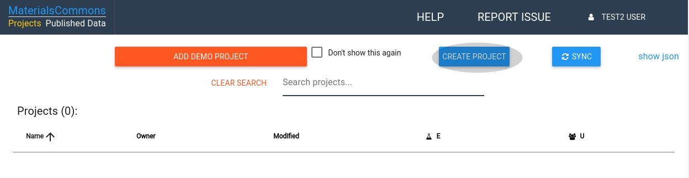
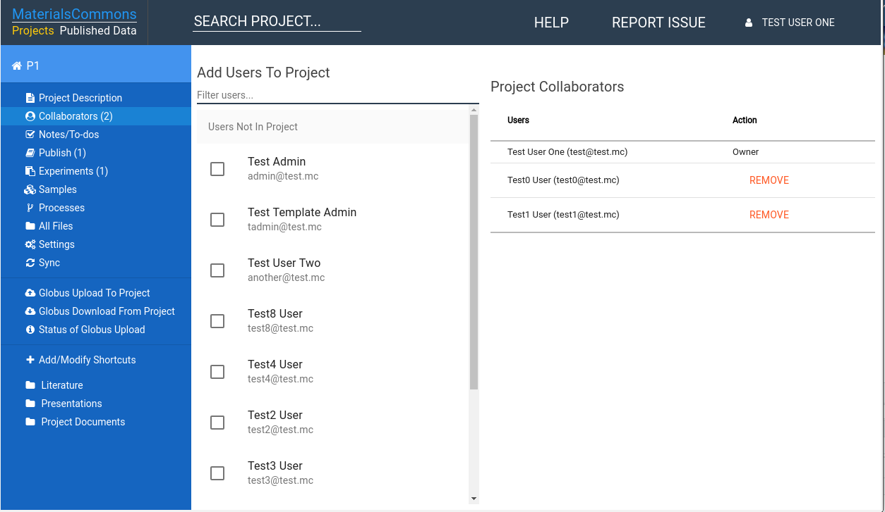
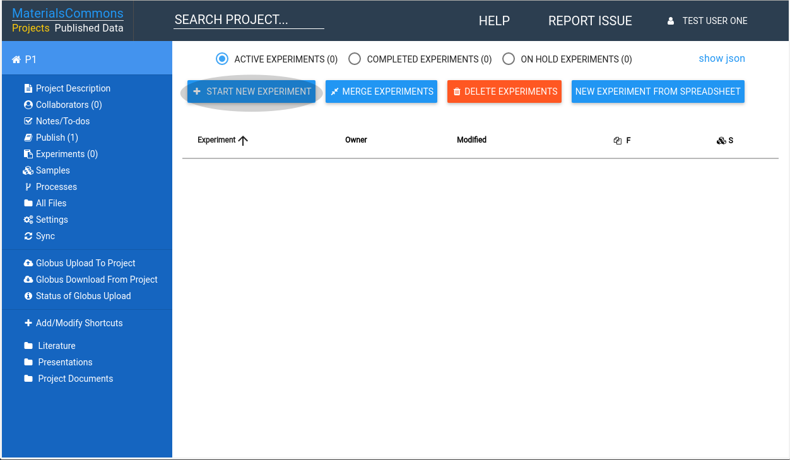
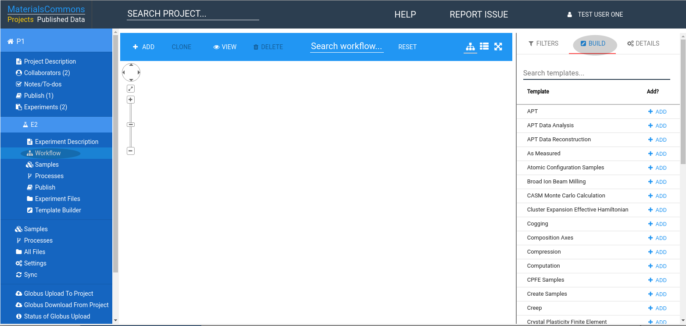
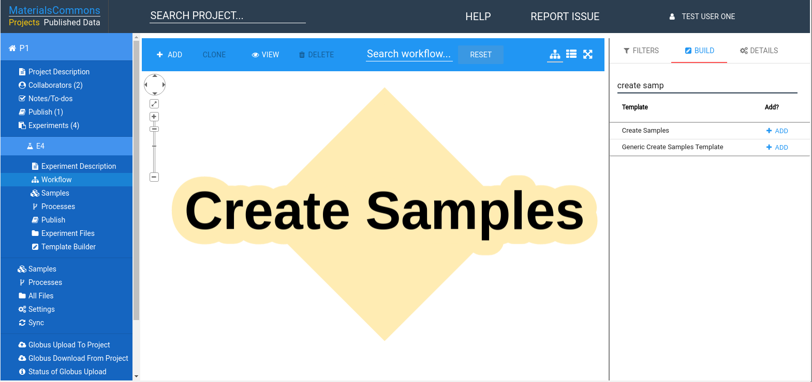
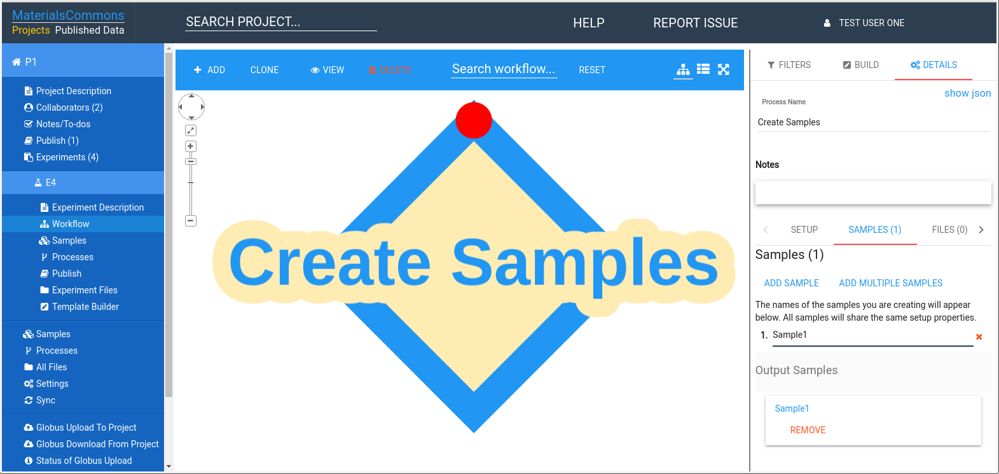
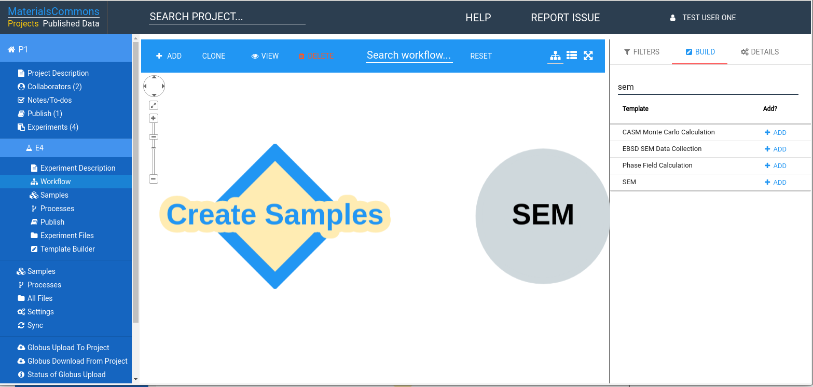
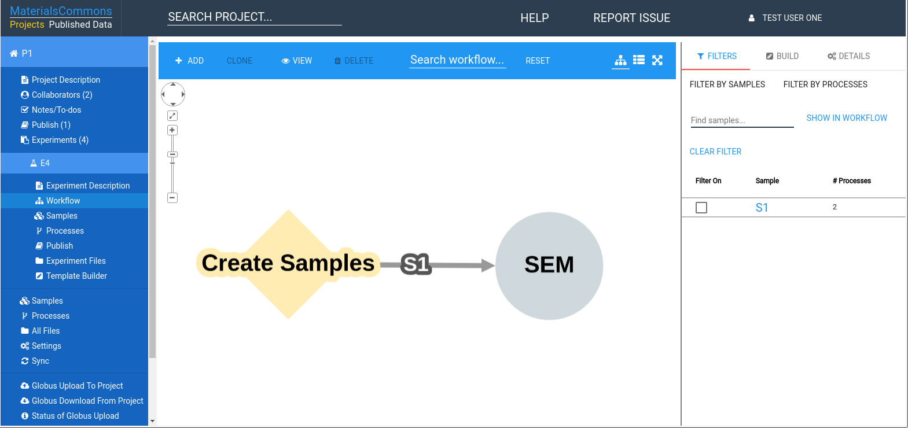

# Overview

This getting started guide will take you through project creation, adding data, setting up your workflow,
sharing and publishing your results. Materials Commons gives you a way to collaborate within your project,
create experiments and track your progress. When you are all done you can pick a subset of your data
and publish. You can assign a DOI, put that in a paper and give others easy access to your data.

Materials Commons makes use of Globus to handle large scale uploads and downloads in a reliable fashion.
Within Materials Commons you can easily share subsets of your data (we call them datasets). This allows
you to organize your data, validate it and finally publish it to a wider audience.

# First Steps
Everything in Materials Commons starts with a project. A project allows you to set up the list of collaborators
you are sharing your files with. It's where you set up your experiments, create your datasets, and publish your
data from. You can set up many projects in Materials Commons, allowing you to separate who you share your data with.

# Creating A Project

When you first login to Materials Commons you will be presented with a list of all your projects. To create your
first project press the "CREATE PROJECT" button in the projects list page. This will prompt you to enter a name
and optional description for your project.

Once you have created a project it will appear in your list of projects. Clicking on the project will take
you to the project home page.

All pages for your project share the left side navbar. The navbar gives you quick access to the various parts
of your project, such as files, datasets, the samples and processes in your project, and other features.

Once you have created a project you can set up who has access to it.

# Setting Project Access

To add collaborators to your project click on the "Collaborators" link in the sidebar. This link will also show
you a count of the collaborators in your project. 

The collaborators page allows you to add and remove users from your project. **Only users who already have a Materials Commons Account
can be added as collaborators**.

To add new users to your project select from the list on the left. To remove existing users press "REMOVE" next to their name in 
the right hand list. Only the project owner can add/remove users from a project.

The next step is to upload your files into Materials Commons.

# Uploading Data

## Overview

Materials Commons provides a variety of ways to upload your files. For quick uploads of a couple of files that aren't too large
you can use the Materials Common UI to upload these. We also provide a Globus interface to reliably upload large files or
large sets of files. Lastly, if you would prefer to work from the command line the Materials Commons CLI command (mc) provides
a way to script your uploads.

Materials Commons also provides integration with PRISMS Center computational tools. If you are using one of these tools
then the files from your computational runs will be automatically uploaded to Materials Commons.

### Materials Commons UI Uploader

The Materials Commons UI provices a way for creating directories and uploading files onto the Materials Commons server.
You can access this functionality from the sidebar by clicking on the "All Files" link.

This will take you to a page that allows you to explore your files and directories. Across the is a link "UPLOAD FILES" selecting this
will bring you to page where you can upload one or more files. The files will be uploaded into the Materials Commons directory you were
viewing when you selected the "UPLOAD FILES" link.

Click in or drag files into the box titled "CLICK TO SELECT FILES FOR UPLOAD". Once you have selected files click on "UPLOAD SELECTED FILES" to
upload the files to Materials Commons. After your files are uploaded click the "CLOSE" button. This will take you back to the directory you were
last viewing.

### Globus

If you have a large transfer then you can use Globus to upload files into your project. Globus is designed to reliably handle large file transfers.
If you haven't used Globus before head over to http://globus.org to get started.

To upload files into your project click on the link "Globus Upload To Project" in the sidebar:

This will create a one time link that you can upload files to. It will then bring up a dialog with a link to the Globus UI, 
with this directory selected.

# Creating Your First Experiment

The project home page contains a list of all your experiments. Across the top of the list of experiments are buttons
for creating, deleting and merging experiments. The next section will go over creating experiments from a spreadsheet.

To create an experiment click on the button "START NEW EXPERIMENT". This will bring up a dialog to enter a name and
optional description for your new experiment.

## Loading A Spreadsheet

Materials Commons supports loading spreadsheets to create experiments. This has the advantage of working with your existing
data. With a few small modifications to your spreadsheet Materials Commons can create your samples, processes and even your
workflow.

To get started [click here](spreadsheets.md#overview).

## Manually Setting up a Workflow

The Materials Commons Workflow editor allows your to manually create your workflows. Creating a workflow manually can
involve many steps. If you are able to we recommend having your workflows created automatically by loading a spreadsheet
or using a tool that is integrated with Materials Commons.

The following steps will show you how to create a workflow.

Click on "Workflow" in the sidebar and then select "Build" in the tabs on the right.

Follow the steps in this order:

1. Create Process from the "Create Samples" Template by searching for create samples and selecting it.

2. Select the "Create Samples" yellow diamond in the workflow editor, then select "Details" tab. Click on "Samples"
tab under "Details", press "ADD SAMPLE" and give your sample a name.

3. Select "Build" tab and search for SEM template, selecting it.

4. Move your mouse over the "Create Samples" diamond in the workflow editor. A red dot will appear at the top of the
diamond, click and hold your left mouse button down. Now move your mouse towards the SEM circle. An arrow will appear
as you move the mouse. Attach the arrow to the Red dot that appears on the SEM circle.

You have now created a workflow that has two steps. You can continue constructing your workflow by repeating the above
steps. You can select different process templates.

