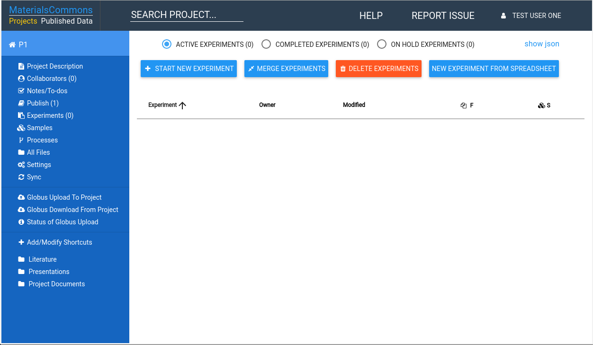
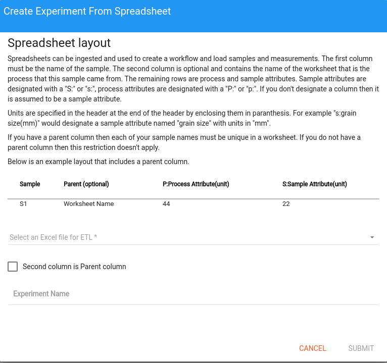

# Overview
Materials Commons allows you to easily load data from a spreadsheet. We call this process ETL, 
which stands for (E)xtract, (T)ransform, and (L)oad. As long as you follow a couple of simple
rules Materials Commons can read your spreadsheet and automatically create the samples,
processing steps, measurements and process attributes.

## Format

There are 3 required rules to follow when constructing a spreadsheet for Materials Commons to process.
All other rules are optional.

  1. The first column contains the names of your samples
  2. The first row consists of headers
  3. Each processing step must be in a separate sheet. The processing step will have the same name as the sheet.
  
This will look as follows:

| Sample Name | Attribute 1 | Attribute2 |
| ----------- | ----------- | ---------- |
|  Sample 1   |   4.0       | 5          |
|  Sample 2   |   4.1       | 5.01       |

By default Attributes are considered process attributes. To see how to specify sample attributes
see "Specifying Column Types".

## Units
To include units you add them into your attribute header in between paranthesis. For example
Attribute 1(mm) means that all measurements for Attribute 1 are in mm.

Your spreadsheet would now look as follows:

| Sample Name | Attribute 1 (mm) | Attribute2 (s) |
| ----------- | ---------------- | -------------- |
|  Sample 1   |   4.0            | 5              |
|  Sample 2   |   4.1            | 5.01           |

## Specifying Column Types

Your first column must be the sample names. After this you can control how Materials Commons will
interpret each column. To do this you use keywords. A keyword is a special word that Materials Commons
understands followed by a colon. Keywords are case insensitive. For example file: is a keyword. You
can type it as file:, File:, FILE:, fILe:, any of these combinations will work. A keyword must appear
as the first word in your column header. Materials Commons will ignore any extra whitespace before
the keyword.

Currently Materials Commons understands the following keywords

| Keyword | Meaning |
| ------- | ------- |
| s, sample, sample attribute | Column specifies a sample attribute |
| p, process | Column specifies a process attribute (remember by default columns are process attributes, so this is optional)|
| f, file, files | Column specifies a file entry|
| i, ignore, note, notes | Column is ignored and not processed |

Here is an example using some of these keywords

| Sample Name | s:GS(mm) | p:Time(sec) | p: Temp (k) | note: | i:is valid? | file:P1/Dir1/Dir2 |
| ----------- | ---------------- | ------------ | ----------------- | ---- | --------- | --------------- |
| S1          | 42               | 100          | 400               | some flux | yes | image.jpg |

## Associating Files

In Materials Commons you can associate files with your processes and samples. Materials Commons will then show you the
files associated with the sample/process you are looking at. You can also do this within your spreadsheet. The file:
keyword lets you specify a column that can contain files (one per cell in the column) with your samples.

There are a couple of rules to make this work:

  1. The files must already be uploaded into your project on Materials Commons
  2. You must specify the directory as Materials Commons understands it to the file
  
### Materials Commons Directory Paths

Materials Commons directories start with your project name. For example, if you have a project named "My 1st Project",
and a directory "D1" that contains the file "measurements.txt", the path to that file is:

My 1st Project/D1/measurements.txt

A couple of things to note. First there is no starting slash, ie its "My 1st Project" and not "/My 1st Project". In file system terms
"My 1st Project" is the "root" or start of your projects files. Secondly you separate the remaining parts of the path with a forward 
slash "/", and not the windows backward slash "\".

### Using the file: keyword

The file: keyword has two forms: 
  1. `file:directory path`
  2. `file:description:directory path`
  
Here are examples for each of these:

file:My 1st Project/D1

file:Sample Measurements:My 1st Project/D1

The file: keyword is used to specify the directory in a column where files are located. An example spreadsheet would look as follows:

| Sample Name | file:My 1st Project/D1 | file:Sample Images:My 1st Project/Images |
| ----------- | ---------------------- | --------------------------------- |
| S1          | measurements.xlsx      | S1.jpeg                           |
| S2          |                        | S2.jpeg                           |
| S3          |                        | My 1st Project/Other/S3.jpeg      |

There are a couple of things going on in this example. First you can see an example using each of the forms of the file: keyword. Secondly
you can have blank column, as S2 and S3 have for the "file:My 1st Project/D1" column. And lastly the S3 file entry looks different because
the cell for the file contains a full path.

The sample S3 entry demonstrates one other feature of the file: column. If you have a cell that contains a "/" in it, then it is assumed
that it contains a full path name, and the path name specified in the file: keyword is ignored. This is really handy for a couple of
reasons. It allows you to just put in your file names in your cells (such as S1.jpeg) without have to specify the whole path. And it
allows you to override this path where you have a special case. Alternatively for S3 you could have created a 3rd file: column. This is
also a good approach. But if you only have a single or small number of special case paths, creating an extra column may only serve to
make your spreadsheet wider without adding much value.

### Multiple files for a sample

To specify multiple files you need to have multiple columns. At this time a cell can only contain a single file entry.

## Ignoring Columns 

You can tell Materials Commons to ignore a column by using one of the following keywords: i:, ignore:, note:, notes:. These keywords
are special in that if they are in the only word in a column you can drop the ":". For example:

| Sample Name | i:Valid? | notes |
| ----------- | -------- | ----- |
| S1          | No       | Wrong settings on SEM |
| S2          | Yes      | Best run yet! |

In the above spreadsheet Materials Commons will ignore the i:Valid? and notes columns. The values in these cells in these columns will not be processed.

## Blank Cells 

Materials Commons will ignore blank cells when processing your spreadsheet. However, sometimes you want to explicitly mark a cell
in a special way. If the cell is blank it could mean you still have to get that measurement, or it could mean that it is not appropriate
to have a value in that cell. Materials Commons will ignore cells that contain the word "blank" or "n/a". For example:

| Sample Name | S:grain size(mm) | P:Temperature(k) |
| ----------- | -------- | ----- |
| S1          | N/A       | 400 |
| S2          | 3      | n/a |

In the spreadsheet above Materials Commons will ignore grain size for S1 and Temperature for S2. Remember that Materials Commons recognizes
special and keywords regardless of their case.

## Building A Workflow

In this section you will learn to construct a workflow using your spreadsheet. This allows you to specify the processing steps
a Sample goes through. Materials Commons will then construct a graphical representation of this workflow. To do this you need
to have multiple worksheets in your spreadsheet, and the second column of your spreadsheet becomes special. In the second
column you will specify the preceding step. The example below shows two tables. Each table represent a separate worksheet
with the name given in bold.

Sheet: **SEM**

| Sample Name | From | S:grain size(mm) |
| ----------- | ---- | ---------------- |
| S1          | Heat Treatment | 4      |

---------------

Sheet: **Heat Treatment**

| Sample Name | From | P:Time(m) | P:Temp(k) |
| ----------- | ---- | --------- | --------- |
| S1          |      | 30        | 400       |

The example above is for a spreadsheet with two worksheets. One named "SEM" and one named "Heat Treatment". The From column
specifies the previous processing to SEM S1 sample. That is it went through a "Heat Treatment" process. Materials Commons
will construct a workflow that looks as follows:

Create Samples -> Heat Treatment -> SEM

Create Samples is a special process that Materials Commons creates that denotes the starting point for all samples.

When constructing a spreadsheet that specifies a workflow column 1 and column 2 are treated specially. Otherwise only
column one is treated specially.

## Loading a Spreadsheet into Materials Commons

To process a spreadsheet in Materials Commons you must have already uploaded the file into the project. After that you can use the spreadsheet to
create a new experiment. To do this go to your project home page:

In the right hand panel at the top are four buttons. The last one is labeled "NEW EXPERIMENT FROM SPREADSHEET". Press this button
and follow its prompts. If you are building a workflow with your spreadsheet make sure to review the "Building A Workflow" section
above and to select "Second column is Parent column":

