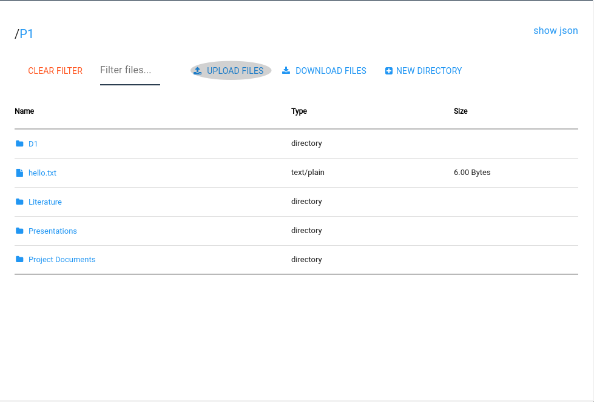
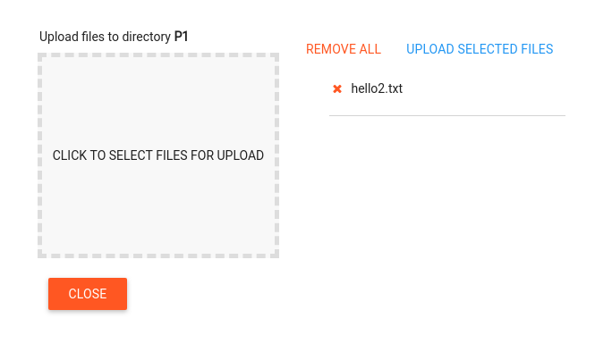

# Overview

Materials Commons provides a variety of ways to upload your files. For quick uploads of a couple of files that aren't too large
you can use the Materials Common UI to upload these. We also provide a Globus interface to reliably upload large files or
large sets of files. Lastly, if you would prefer to work from the command line the Materials Commons CLI command (mc) provides
a way to script your uploads.

Materials Commons also provides integration with PRISMS Center computational tools. If you are using one of these tools
then the files from your computational runs will be automatically uploaded to Materials Commons.

## Materials Commons UI Uploader

The Materials Commons UI provices a way for creating directories and uploading files onto the Materials Commons server.
You can access this functionality from the sidebar by clicking on the "All Files" link.

This will take you to a page that allows you to explore your files and directories. Across the is a link "UPLOAD FILES" selecting this
will bring you to page where you can upload one or more files. The files will be uploaded into the Materials Commons directory you were
viewing when you selected the "UPLOAD FILES" link.

Click in or drag files into the box titled "CLICK TO SELECT FILES FOR UPLOAD". Once you have selected files click on "UPLOAD SELECTED FILES" to
upload the files to Materials Commons. After your files are uploaded click the "CLOSE" button. This will take you back to the directory you were
last viewing.

## Globus

If you have a large transfer then you can use Globus to upload files into your project. Globus is designed to reliably handle large file transfers.
If you haven't used Globus before head over to http://globus.org to get started.

To upload files into your project click on the link "Globus Upload To Project" in the sidebar:

This will create a one time link that you can upload files to. It will then bring up a dialog with a link to the Globus UI, with this directory selected.

## Materials Commons CLI

TBD